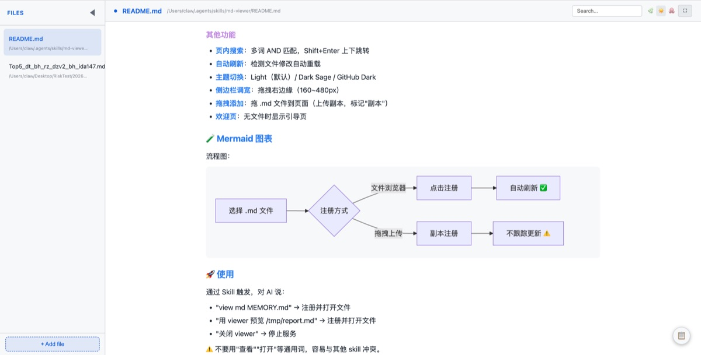

# 🧰 Public Agent Skills & Plugins

AI Agent 的工具箱 —— 自研 Skills & Plugins + 开源生态，开箱即用。

<h4 align="center">
    
  
</h4>

## 📌 使用方式

每个 Skill/Plugin 可直接用于 OpenClaw 等 Agent 框架。具体安装和使用方式见各 Skill/Plugin 的 README

目前仅在 OpenClaw ≥ 2026.5.28 自验证。

---

## 🛠️ Skills（自研）

### 🔧 效率工具

<table>
<tr>
  <th width="120">Skill</th>
  <th width="240">说明</th>
  <th>关键特性</th>
</tr>
<tr>
  <td><a href="./skills/md-viewer/">md-viewer</a></td>
  <td>✨ 给 Markdown 开扇窗 本地 Markdown 文件浏览器</td>
  <td>GFM 渲染、Mermaid 图表、目录导航、图片放大、文件浏览、自动刷新、主题切换 </td>
</tr>
</table>

### 🧩 能力扩展

<table>
<tr>
  <th width="120">Skill</th>
  <th width="240">说明</th>
  <th>关键特性</th>
</tr>
<tr>
  <td><a href="./skills/openclaw-lark-stream-plus/">openclaw-lark-stream-plus</a></td>
  <td>飞书流式增强 群聊流式输出 + 跨插件通信</td>
  <td>群聊流式、跨插件通信、标记包裹可还原</td>
</tr>
</table>

### ⚙️ 系统运维

持续更新中…

---

## 🧩 Plugins（自研）

> 待补充

## 📦 Skills（开源）

> 待补充

## 🔌 Plugins（开源）

> 待补充
