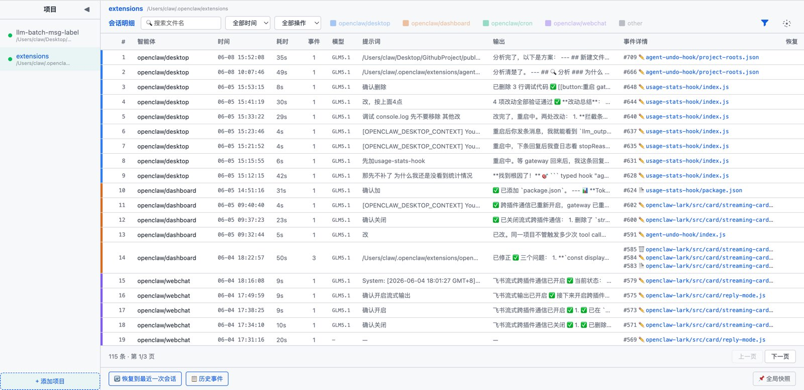
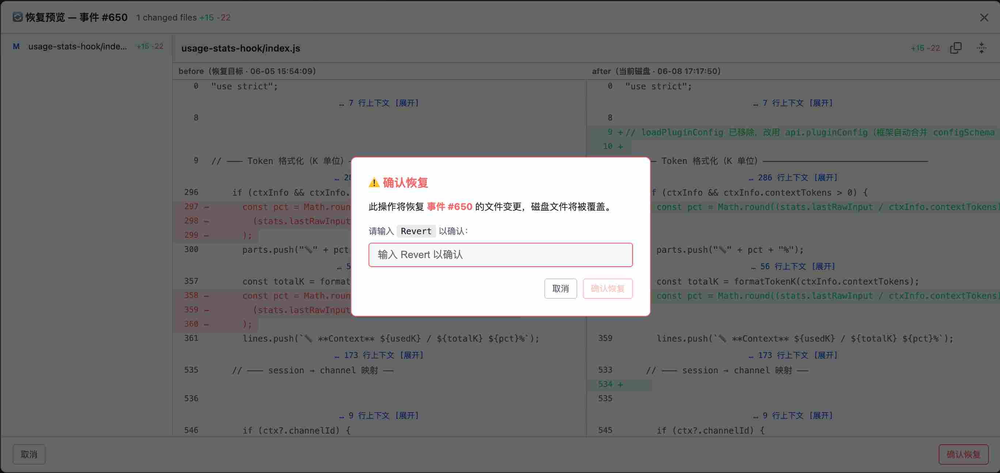
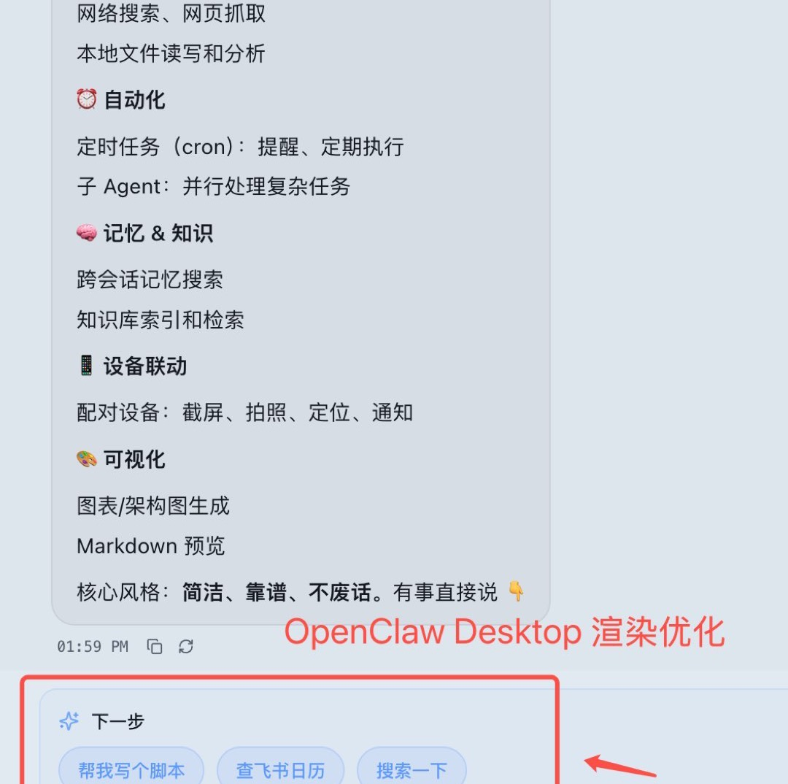
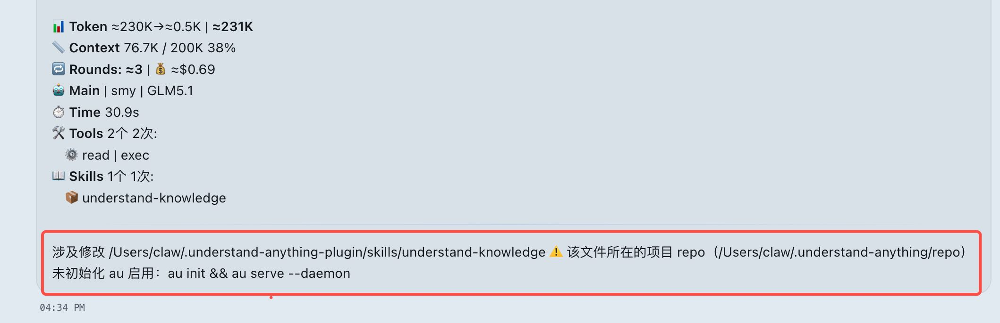

# 🧰 Public Agent Skills & Plugins

AI Agent 的技能书和工具箱 —— 自研 Skills & Plugins + 开源收录。

<h4 align="center">
  
</h4>

## 📌 使用方式

每个 Skill/Plugin 可直接用于 OpenClaw 等 Agent 框架。具体安装和使用方式见各 Skill/Plugin 的 README

目前仅在 OpenClaw ≥ 2026.5.28 自验证。

---

## 🛠️ Skills（自研）

### 🔧 效率工具

<table>
<tr>
  <th width="200">Skill</th>
  <th width="300">说明</th>
  <th>关键特性</th>
</tr>
<tr>
  <td><a href="./skills/md-viewer/">md-viewer</a></td>
  <td>✨ 给 Markdown 开扇窗 → 本地 Markdown 文件浏览器 + 2.0 酷炫主题渲染</td>
  <td>🎨 4 套主题（极光/杂志/卡通/黑白）、H2-H4 层级递减设计 </td>
</tr>
<tr>
  <td><a href="./skills/au-viewer/">au-viewer</a></td>
  <td>🔄 自动备份是最朴素但又实用的发明 → Agent 文件变更可视化及回滚 🔥 强烈推荐三件套： 　CLI 层 <a href="https://github.com/sadjjk/agent-undo">agent-undo (Fork)</a> 　Hook 层 <a href="./plugins/agent-undo/">agent-undo-hook</a> 　Skill 层 <a href="./skills/au-viewer/">au-viewer</a></td>
  <td>diff 对比、一键回滚、全局快照、文件 Blame  </td>
</tr>
</table>

### 🚀 能力扩展

<table>
<tr>
  <th width="200">Skill</th>
  <th width="300">说明</th>
  <th>关键特性</th>
</tr>
<tr>
  <td><a href="./skills/openclaw-lark-stream-plus/">openclaw-lark-stream-plus</a></td>
  <td>⚡ 打字机特效是AI聊天里最直观的发明 → 群聊流式 + 跨插件通信</td>
  <td>群聊流式输出、跨插件通信、标记包裹可还原</td>
</tr>
<tr>
  <td><a href="./plugins/follow-up-hook/">follow-up-hook</a></td>
  <td>💡 追问是种品质，答案从来不是终点 → 每轮回复后自动追加追问建议</td>
  <td>Skill版本-三层追问、触发词匹配、上下文紧张时可能会失效</td>
</tr>
</tr>
</table>

### 🏢 业务场景

<table>
<tr>
  <th width="200">Skill</th>
  <th width="300">说明</th>
  <th>关键特性</th>
</tr>
<tr>
  <td><a href="./skills/credit-risk-offline/">credit-risk-offline</a></td>
  <td>🏦 拧螺丝一块钱 知道在哪拧九十九块 → 风控离线建模全流程辅助</td>
  <td>用自然语言管理样本、特征、模型三层配置 全流程标准化管理 CLI + Skill 分工协作 
  <table>
  <tr><th>层</th><th>核心能力</th></tr>
  <tr><td>📁 项目层</td><td>查看项目列表 / 新建项目</td></tr>
  <tr><td>🗂 样本层</td><td>样本查询 / 添加 / 标签分析 / 报告 / 确认</td></tr>
  <tr><td>🔧 特征层</td><td>特征查询 / 添加 / 漏斗式筛选 / 单特征探查 / 确认</td></tr>
  <tr><td>🤖 模型层</td><td>模型查询 / 添加划分 / 训练评估 / 报告 / 定稿</td></tr>
  </table>
  </td>
</tr>
</table>

---

## 🧩 Plugins（自研）

### 🚀 能力扩展

<table>
<tr>
  <th width="200">Plugin</th>
  <th width="300">说明</th>
  <th>关键特性</th>
</tr>
<tr>
  <td><a href="./plugins/follow-up-hook/">follow-up-hook</a></td>
  <td>💡 追问是种品质，答案从来不是终点 → 每轮回复后自动追加追问建议</td>
  <td>Plugin版本（强烈推荐）-三层追问、Hook 自动注入、每轮额外消耗 token </td>
</tr>
<tr>
  <td><a href="./plugins/usage-stats-hook/">usage-stats-hook</a></td>
  <td>⚖️ 这一句到底值多少仁义道德 → 每轮回复后自动追加统计信息</td>
  <td>compact/detailed 双模式 ；展示Token/上下文/消耗/工具/技能等统计 </td>
</tr>
<tr>
  <td><a href="./plugins/agent-undo/">agent-undo-hook</a></td>
  <td>🪶 Agent做起事来 可轻如鹅毛 亦可重于泰山 → Agent 文件变更自动归因与回撤</td>
  <td>轮次级归因、自动识别项目、项目隔离、渠道类型归因 </td>
</tr>
</table>

## 📦 Skills（收录）

> 待补充

## 🔌 Plugins（收录）
<table>
<tr>
  <th width="200">Plugin</th>
  <th width="300">说明</th>
  <th>关键特性</th>
</tr>
<tr>
  <td><a href="https://github.com/peaktwilight/agent-undo">agent-undo</a> <a href="https://github.com/sadjjk/agent-undo">agent-undo (Fork)</a></td>
  <td>💊 要是能重来 我要选李白 → 人无法回撤 但AI Agent一定要可以</td>
  <td>原版提供了非常好的类似 git 的轻量化命令 au，但只支持 Claude Code，于是 Fork 魔改 支持更多Agent</td>
</tr>
</table>
