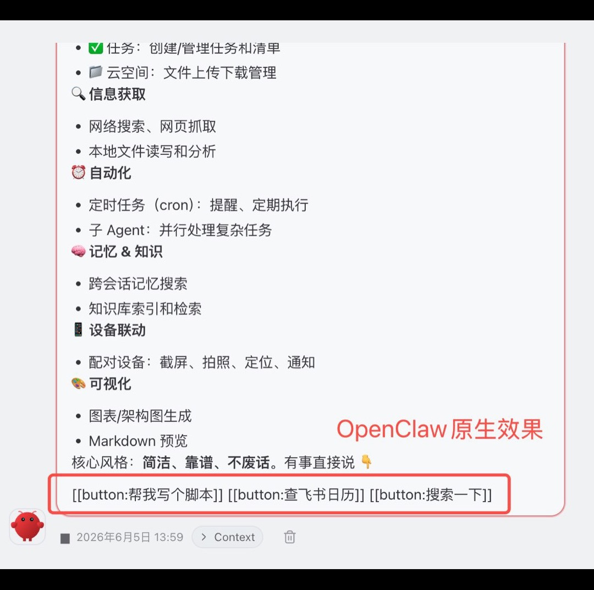
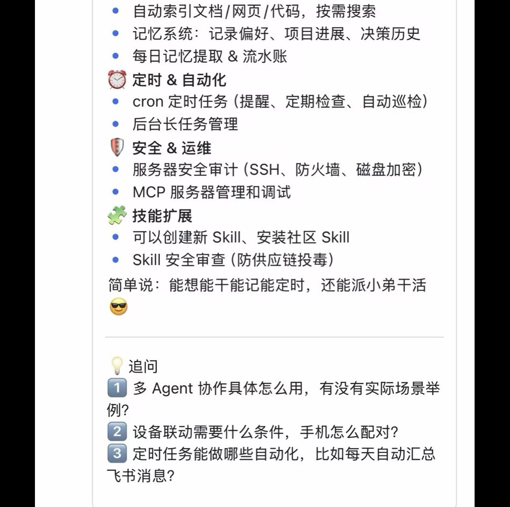

# Follow-Up Hook

每轮回复后自动追加追问建议，降低对话继续的门槛。

## 💬 作者说

追问是种能力。

Agent 做完了，顺便再自我问一句

有时候真有意外惊喜，它能提出没察觉的角度或思路。

## ✨ 功能一览

| 模式 | 说明 | 特点 |
|------|------|------|
| 插件模式 | `before_prompt_build` 自动注入追问指令，无需触发词 | ⭐ 强烈推荐，但每轮额外消耗 token |
| Skill 模式 | 触发词匹配后注入追问规则，被动触发 | 渐进式，上下文紧张时选择性忽略 |

### 效果展示

| OpenClaw Desktop | 原生 webchat | 飞书 |
|---|---|---|
|  |  |  |
| button 可点击 | 文字列表 | 文字列表 |

### 追问规则

- 三层追问：①基础 → ②进阶 → ③深挖
- 每条紧扣本轮话题，含具体关键词，有深挖角度
- 禁止：动词开头、yes/no 问法、待办清单式
- 跳过：闲聊/情绪/结束/有确认/纯工具回复

## 🚀 使用

**插件模式**（推荐）：

```bash
# 在 openclaw-extensions 目录下执行
cd plugins/follow-up-hook/openclaw-extensions
openclaw plugins install .
```

**Skill 模式**：

将 `SKILL.md` 复制到 `~/.agents/skills/follow-up-hook/` 或 `~/.openclaw/skills/follow-up-hook/`

触发词自动匹配 或对 AI 说"追问"、"继续问"、"follow-up"。

## 💡 Tips

webchat 渠道追问用 `[[button:问题]]` 格式，其他渠道用文字列表

因为 [OpenClaw Desktop](https://github.com/wzdavid/openclaw-desktop) 对 button 做了特定优化

`[[button:问题1]]` 会被渲染成可点击按钮，非常优雅。

强烈推荐这个客户端。

---

详细规则见 [SKILL.md](SKILL.md)。
