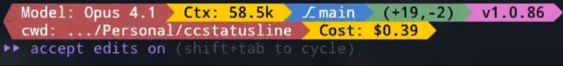
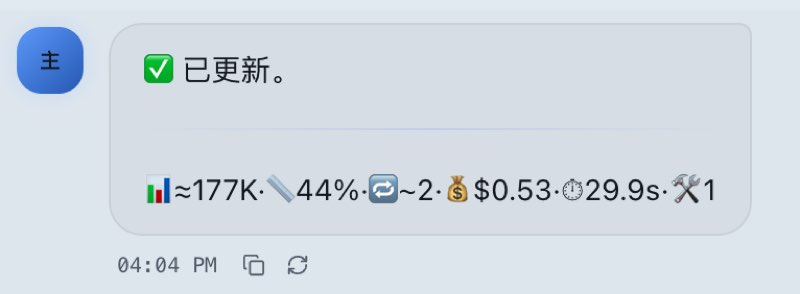
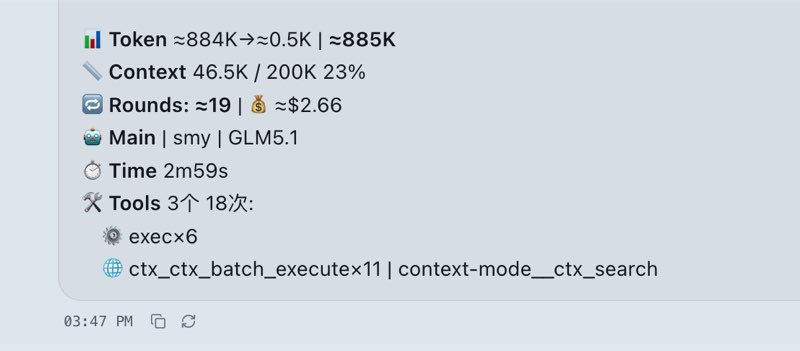
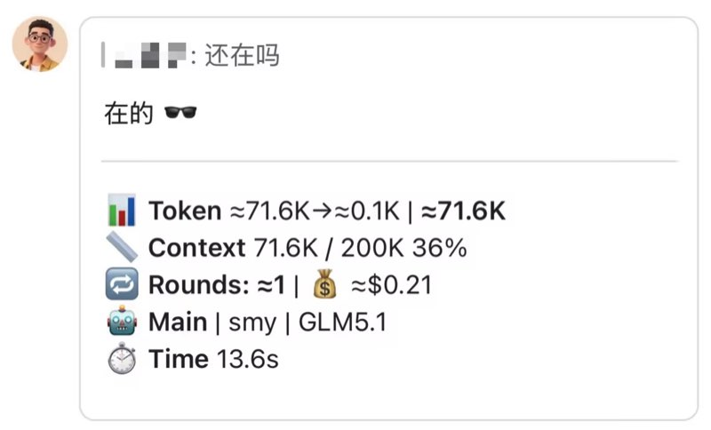

# Usage Stats Hook
每轮回复后自动追加统计信息，让 token 和费用等一目了然


## 💬 作者说
一句【在吗】就要 70K+ Token

到底 用了几个技能 用了几个工具 用了多少上下文 最后又花了多少钱

大部分现成的统计情况都展示在日、周、月级别

缺少对话级别的统计 于是就造了一个

这其实与 CC 状态栏有异曲同工之妙。

CC 状态栏 是展示在状态栏里 这是塞在每句话的最后面

compact 模式一行搞定，detailed 模式展开细节。

具体的Token是估算值 不是完全精确值 但也很接近

因为底层机制限制 必须等一句话回复完整才能拿到最终的Token输出值

但该功能又是塞在对话后面 一起发出来的 必须发完才能算出来准确值

因此使用估算法 不会相差太多

## ✨ 功能一览

| 模式 | 说明 | 额外消耗 |
|------|------|----------|
| compact | 单行精简统计 | ~16 tokens |
| detailed | 多行详情统计 | ~85 tokens |

### 效果展示

| | |
|---|---|
|  <br/> **CC 状态栏**  |  <br/> **compact** — 单行精简 |
|  <br/> **detailed** — 多行详情 |  <br/> **飞书** — 卡片内统计 |

### 统计项

| 指标 | 说明 |
|------|------|
| 📊 Token | input→output，含缓存读写 |
| 📏 Context | 上下文占用 / 模型窗口大小 |
| 🔁 Rounds | 估算 API 调用轮数 |
| 💰 Cost | 费用估算（读取 openclaw.json 定价） |
| 🤖 Model | Agent / Provider / Model |
| ⏱️ Time | 总耗时 |
| 🛠️ Tools | 工具调用分类汇总 |
| 📖 Skills | Skill 使用统计 |

## 🚀 安装

```bash
# 在 usage-stats-hook 目录下执行
cd plugins/usage-stats-hook
openclaw plugins install .

# 配置插件（启用 + 允许读取对话上下文）
openclaw gateway config.patch --raw '{"plugins":{"entries":{"usage-stats-hook":{"enabled":true,"hooks":{"allowConversationAccess":true}}}}}'

# 重启生效
openclaw gateway restart
```

**配置**：默认 detailed 模式，无需额外配置：

```json
"usage-stats-hook": {
  "enabled": true
}
```

需要精简模式时：

```json
"usage-stats-hook": {
  "enabled": true,
  "config": {
    "mode": "compact"
  }
}
```

## 💡 Tips

飞书开启流式后，官方默认其他插件追加的内容无法显示。

需要 [openclaw-lark-stream-plus](../skills/openclaw-lark-stream-plus/) 开启流式跨插件通信

统计信息才能在飞书流式卡片中正常显示。

---

详细实现见源码 [index.js](openclaw-extensions/index.js)。
