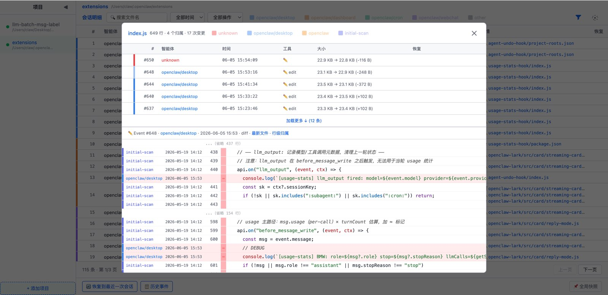

# au-viewer

Agent Undo 的 Web 可视化前端，提供项目级文件变更时间线浏览 + 一键回滚

## 💬 作者说

Agent 改文件，改完就走了。

文件变了，但复盘时一头雾水

什么时候改的？改了什么？谁改的？

Agent Undo CLI 能查，但终端里看 diff 终究不够直观。

于是有了 au-viewer skill

把 au 记录的每一次文件变更，用浏览器可视化呈现：时间线、diff 对比、一键回滚、全局快照

## ✨ 功能

| | |
|---|---|
|  <br/> **初始页** — 项目选择 + 快速入口 |  <br/> **会话明细** — Session 级别操作记录 |
|  <br/> **事件明细** — 单次文件变更详情 |  <br/> **恢复预览** — 左右 diff 对比 + 选区隔离 |
|  <br/> **文件修改历史** — 单文件变更时间线 |  <br/> **确定文件恢复** — 确认后一键回滚 |

其他功能：

- **多维度过滤** — 文件名 / 时间 / Action / Agent / Session
- **文件 Blame** — 行级归属追踪
- **全局快照** — Pin 列表 + 恢复
- **多主题切换**

## 🚀 使用

在 OpenClaw 中触发：

```
au-viewer <项目路径>    # 打开指定项目的时间线
au-viewer               # 打开已注册项目列表
```

详细命令见 [SKILL.md](SKILL.md)。

## ⚙️ 配置

配置文件：`config.json`（首次启动自动创建）

| 参数 | 说明 | 默认值 | 热生效 |
|------|------|--------|--------|
| `port` | 服务端口 | 3457 | ❌ 需重启 |
| `refresh_interval` | 自动刷新间隔（毫秒） | 30000 | ❌ 需重启 |
| `projects` | 已注册项目列表 | [] | ✅ |

## ⚠️ 依赖

- **Node.js** 18+
- **npm**：首次需 `cd server && npm install` 安装 express + better-sqlite3
- **au**：需要本地安装 au CLI（`~/.local/bin/au`）

## 📁 项目结构

```
au-viewer/
├── README.md
├── SKILL.md                  ← OpenClaw skill 定义
├── config.json               ← 配置 + 项目注册表（自动生成，不提交）
└── server/
    ├── au-viewer-server.js   ← 服务端主程序（Express + better-sqlite3）
    ├── index.html            ← 前端模板（全部内联）
    ├── package.json          ← 依赖声明
    └── package-lock.json     ← 依赖锁定
```
