# 风控建模管理 CLI & Skill 

> 风控离线建模辅助 Skill —— 用自然语言管理样本、特征、模型三层配置。

## 设计理念

全流程标准化管理，CLI Script + Skill 分工协作：

| | CLI Script | Skill |
|---|---|---|
| 干什么 | 数据处理、状态管理、流程执行 | 语义判断、流程引导、报告生成 |
| 要什么 | 稳定、可重复 | 能理解、会表达 |
| 举个例子 | 一条命令跑完特征漏斗筛选和分箱PSI | 不是甩一堆数字，而是写出"坏样本率仅 0.37%，建模需关注样本不平衡" |

大部分日常工作像拼积木 每块小功能都有对应的小脚本
但怎么让它们严丝合缝地拼在一起 用起来就像本来就该长在一起一样
这就是工程化的能力

### 创意点

- **Polars高性能计算库 + 并行分箱** — 特征计算全链路走 Polars，CART 分箱用 joblib 多线程并行。

对比常用特征分析库 toad、optbinning，Polars 优化的分箱类显著提速：
| 场景 | 方法 | 耗时(s) | 峰值增量(MB) | 相对基准 |
|------|------|---------|-------------|----------|
| 等频分箱 | *toad* Combiner + WOETransformer | 126.1 | 20,516 | 1.60x |
| 等频分箱 | **NativeBinner** *(Polars)* | 78.8 | 6,769 | 1.00x |
| 最优分箱 | *optbinning* BinningProcess | 125.8 | 628 | 4.49x |
| 最优分箱 | **OptimalBinner** *(Polars)* | 28.0 | 5,532 | 1.00x |

  > 总之就是快，随机评测数据，仅供参考

- **分箱图集成** — 分箱结果直接出图，坏账率趋势 + KS/AUC 一张图看全

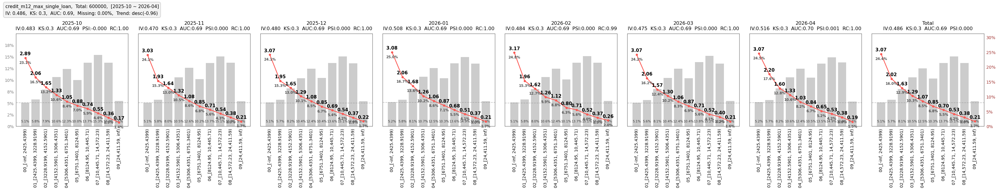

- **三层状态机驱动** — 每一层都有明确的状态流转，当前状态决定能做什么、下一步该做什么

  样本 S0 初始化 → S1 已添加 → S2 异常待修复 / S3 正常待生成报告 → S4 已登记报告 → S5 已确认
  特征 F0 初始化 → F1 已添加待筛选 → F2 已筛选待生成报告 → F3 已生成报告待探查 → F4 已探查待确认 → F5 已确认
  模型 M0 初始化 → M1 模型添加完成 → M2 划分完成 → M3 训练评估完成 → M4 报告已生成 → M5 模型定稿

  操作走流转 查询只读不碰 两条路互不干扰
  断点可续 从哪断从哪接

---

## 功能概览

| 层 | 核心能力 |
|----|----------|
| 📁 项目层 | 查看项目列表 / 新建项目 |
| 🗂 样本层 | 样本查询 / 样本添加 / 样本标签分析 / 样本报告 / 样本确认|
| 🔧 特征层 | 特征查询 / 特征添加 / 漏斗式筛选 / 单特征探查 / 特征确认 |
| 🤖 模型层 | 模型查询 / 模型添加划分 / 模型训练评估 / 模型报告 / 模型定稿 |

### 项目层

| 截图 | 截图 |
|------|------|
| 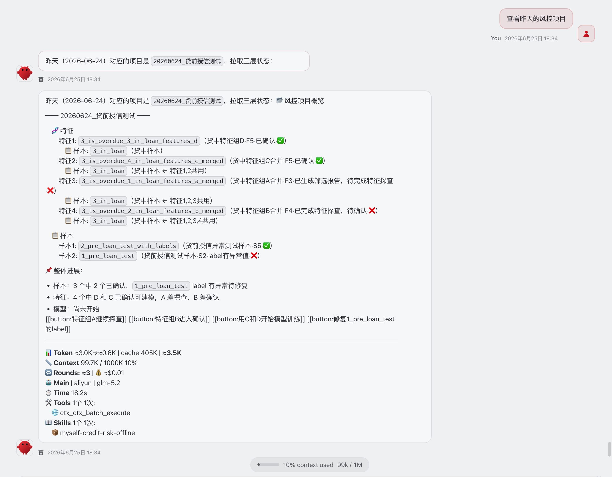 <br/> **查看风控项目** — 查看项目列表与状态 | 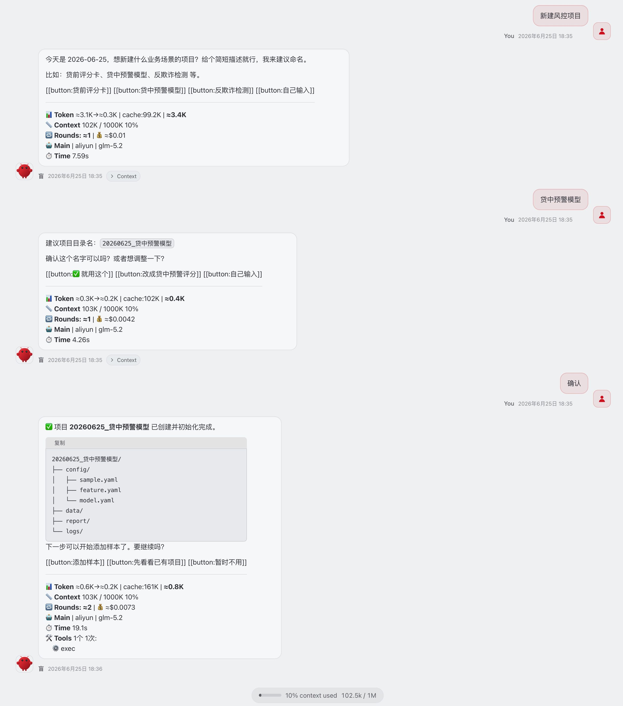 <br/> **新建风控项目** — 新建风控项目 |

### 样本层

**样本状态机**：S0 初始化 → S1 已添加 → S2 异常待修复 / S3 正常待生成报告 → S4 已登记报告 → S5 已确认

| 截图 | 截图 | 截图 |
|------|------|------|
| 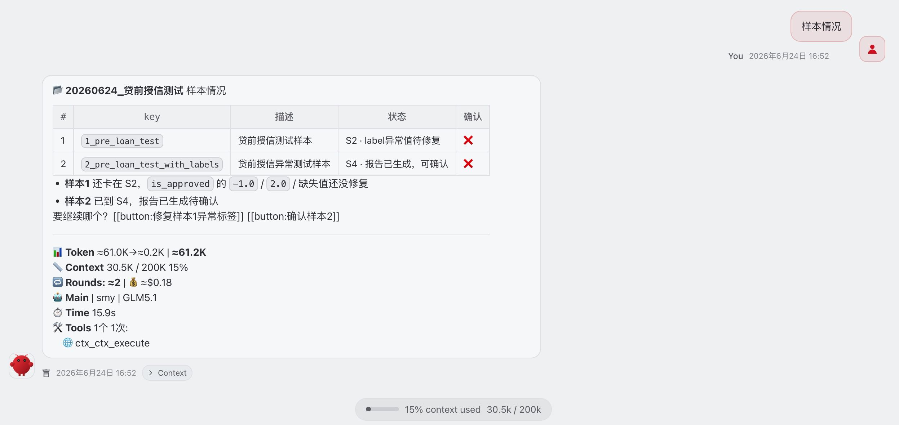 <br/> **样本情况** — 查看样本列表与状态 | 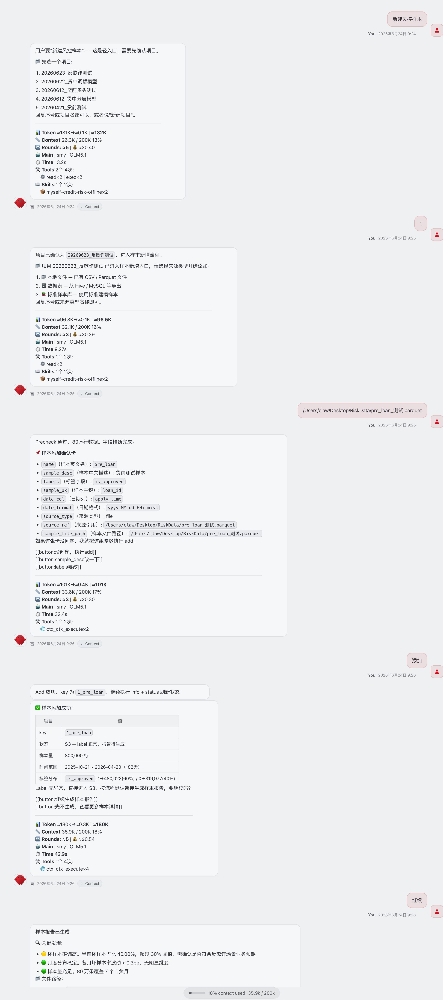 <br/> **新增样本及生成报告** — 添加样本并自动生成报告 | 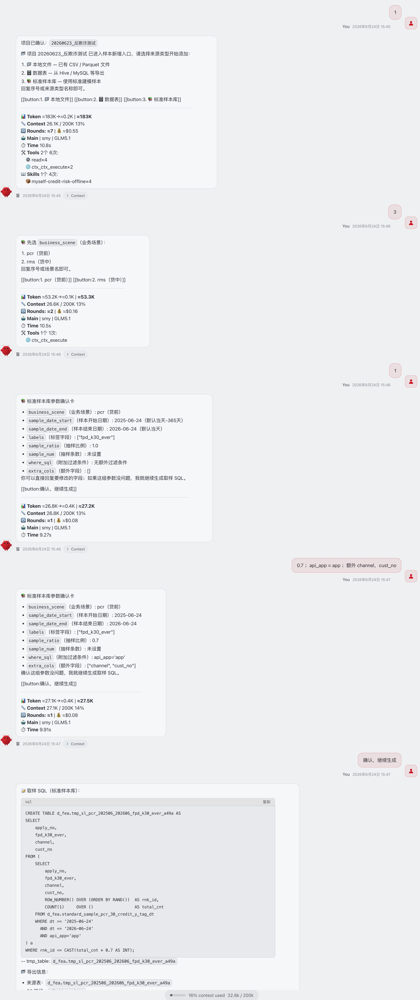 <br/> **标准样本库取数** — 按业务场景取数 |
| 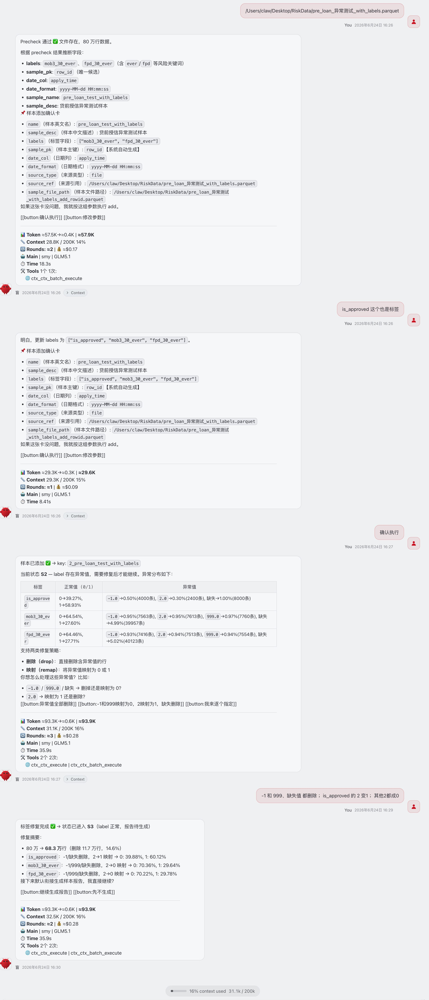 <br/> **标签异常诊断及修复** — 诊断并修复 label 异常 | 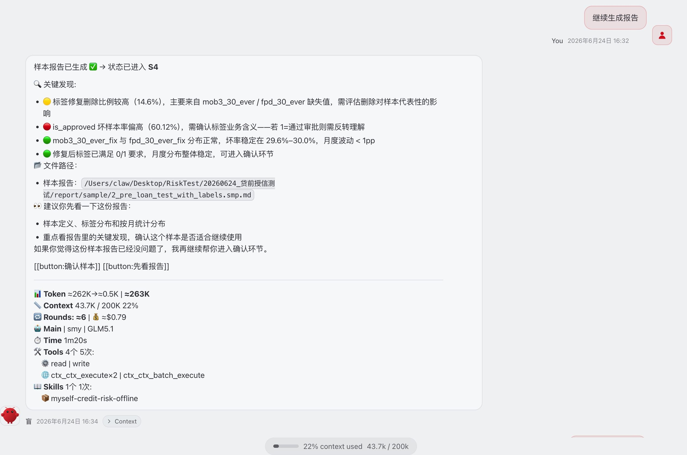 <br/> **样本报告** — 样本分析报告 | 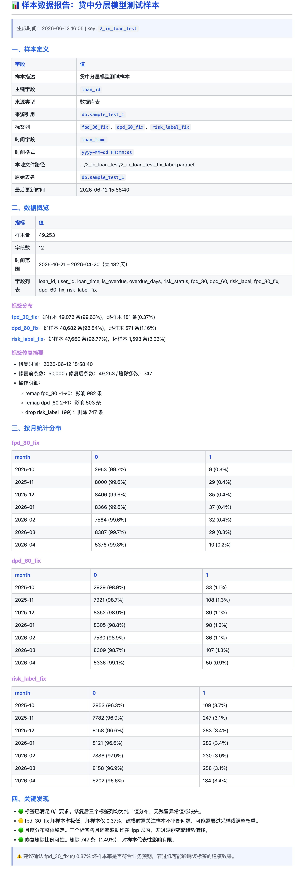 <br/> **样本报告举例** — [完整报告样例](docs/样本生成报告样例.md) |

### 特征层

**特征状态机**：F0 初始化 → F1 已添加待筛选 → F2 已筛选待生成报告 → F3 已生成报告待探查 → F4 已探查待确认 → F5 已确认

| 截图 | 截图 |
|------|------|
| 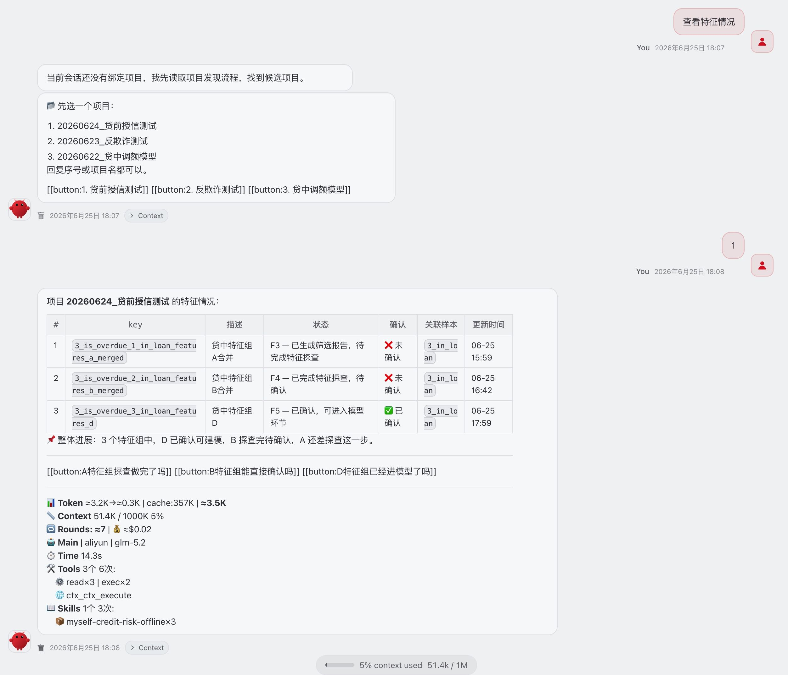 <br/> **查看特征情况** — 查看特征组列表与状态 | 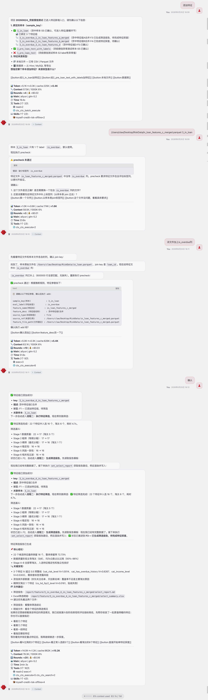 <br/> **添加特征组及筛选报告** — 添加特征组并执行筛选漏斗 |
| 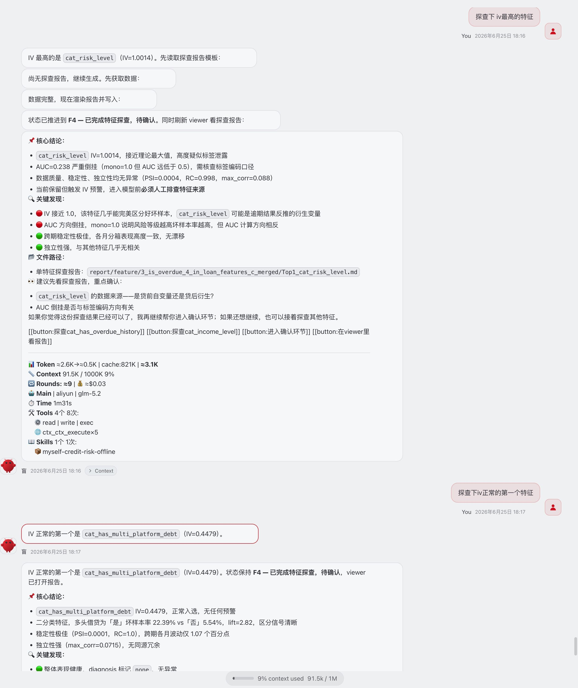 <br/> **单特征探查** — 单特征深度探查报告 | 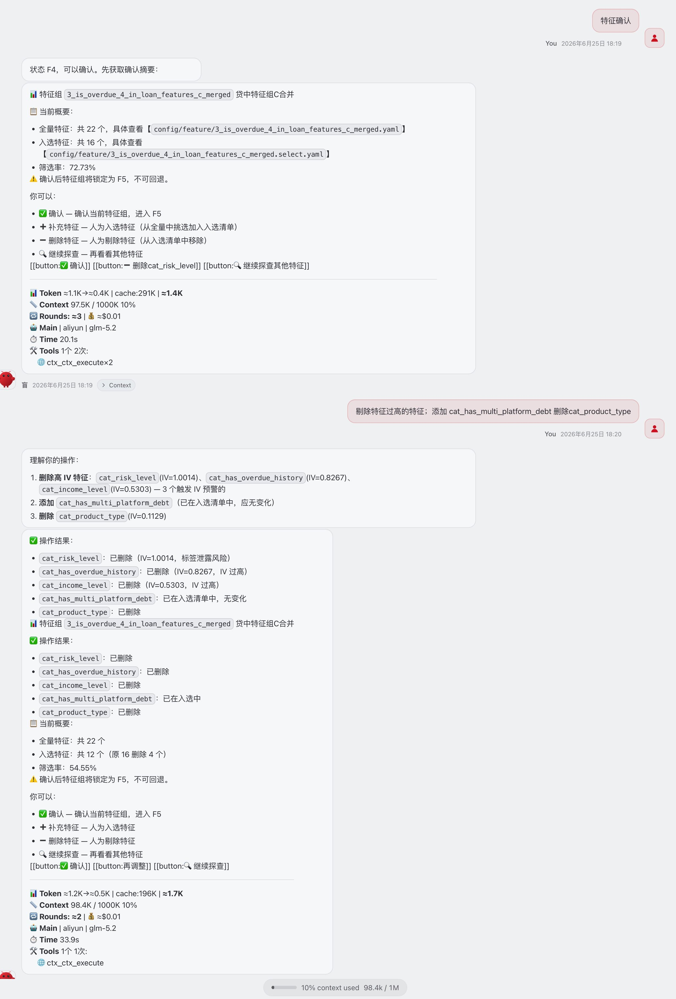 <br/> **特征确认** — 确认前摘要与确认锁定 |


---

## 项目目录结构

各个项目的目录由 CLI Script 和 Skill 共同读写维护，才有了标准化。

人只需要关注结果 对结果审核和负责  报告均在`report` 文件夹里 含【样本、特征筛选、模型评估】等。
其他配置、元数据、缓存、日志，全部自动记录，供后续排查和维护用。

标准化目录结构带来的好处：随时拷贝、随时复盘，风控经验不丢失
Agent 也能快速接手已有项目、继续迭代。

```
{data_dir}/
└── {proj}/                    ← YYYYMMDD_中文项目名
    ├── config/
    │   ├── sample.yaml        ← 样本配置（唯一数据源）
    │   ├── feature.yaml       ← 特征配置
    │   ├── feature/     ← 特征组 feature_ref 列表
    │   └── model.yaml         ← 模型配置（规划中）
    ├── data/
    │   ├── sample/            ← 预处理后的 Parquet 文件
    │   └── feature/           ← 特征缓存（corr_matrix / summary / detail）
    ├── report/
    │   ├── sample/            ← 样本报告 *.smp.md
    │   └── feature/           ← 特征筛选报告与单特征探查报告
    └── logs/
```

---

## 说明

它解决的重点不是替人做业务判断
而是把散落在脚本、注释、口头约定和临时操作里的建模动作收束起来
样本还是那份样本，特征还是那批特征，目标还是那个目标
人来做和 Agent 来做，结果通常不会出现本质性鸿沟
真正被改变的 是 【执行效率 、过程一致性、信息留痕和返工成本】

### 使用边界

样本、特征、模型始终属于建模关键层 默认都应由人工确认
Agent 可以负责整理、检查、生成、串联和推进流程
但不应替代人在关键节点上的判断和拍板
它的价值是把琐碎反复的建模劳动封装成工作流
而不是把建模责任整体转移给自动化

### 免责声明

全自动模式可以执行，但不等于应该执行
跳过人工确认，即视为主动放弃关键节点复核
由此产生的偏差、遗漏、误判及建模结果风险，均由使用者承担
Skill 不对自动化执行结果负责

> | 开源状态 | 内容 |
> |---------|------|
> | ✅ 已开源 | Skill MD — 流程引导 语义理解逻辑 |
> | 🔒 暂未公开 | CLI Script — 核心数据处理与接口 |
>
> Skill 引用了 CLI 各个接口
> 在 Agent 时代 就算没有 CLI Script 源码
> Claude 之类的大模型也能补写出个七七八八 甚至更好
>
> 所以 CLI Script 的具体实现已经没那么重要
> 真正重要的是创意 是见识 
>
> 拧螺丝一块钱 知道在哪拧九十九块
> 知其然知其所以然
